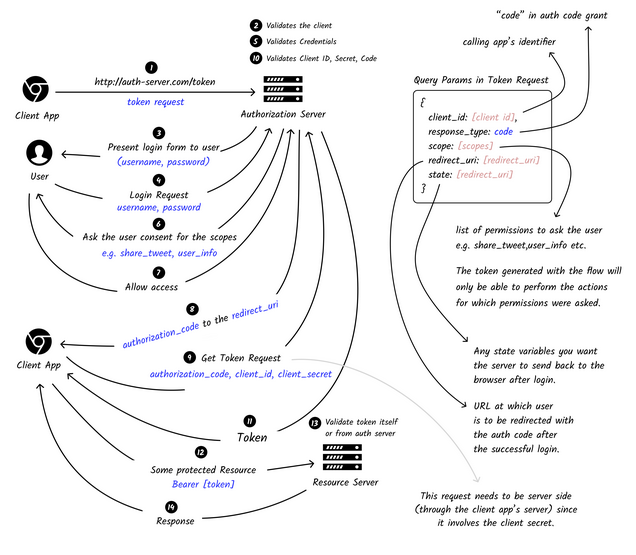
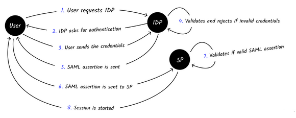

# Types of Authentication
## Session Based Authentication
The user is assigned some unique identifier. The server keeps track of the logged in users in memory or in storage, *e.g.* redis, memory database, filesystem. The client sends the session id in all the requests and the server uses it to identify the user. It's a **stateful authentication methodology.**

It's possible to set a TTL, where the user is logged out after a while.

## Token Based Authentication
A token is sent from client to server in each request. It is a **stateless authentication methodology**.
1. The client sends the credentials to generate a token.
2. Sever validates the credentials.
3. If the credentials were valid, the server provides an access token, which will be saved my the client in local storage or a cookie, and sent in subsequent requests.
4. On a request, the server validades the token, and returns the response if token is valid.

A token as the following characteristics:
- random looking string;
- the server doesn't store it (stateless);
- normally signed with a secret. Any tampering may be identified;
- can be opaque or self-contained;
- normally sent in the *Authorization* header;
- has an expiration time after which the token is not usable.

### JSON Web Tokens (JWT)
Can be used for authorization as well as secure info exchange. The only differentiator is how the token is generated.
- it's a normal URL-Safe string;
- can be passed to server in header, body, or URL;
- self-contained;

#### Structure
- __header__ → the type of token and the hashing algorithm using for the signature.
- __payload__ → contains the data we want to embed in the token, aka **JWT Claims**.
- __signature__ → generated by hashing the header and the payload with a secret held at the server. The secret is used to generate and verify tokens.

#### JWT Claims
There are three type of claims:
- __Registered Claims__ → standard names which are reserved for app usage. They are: *iat* (issued at), *iss* (issuer), *sub* (token subject), *exp* (expire time), *aud* (token audience), *nbf* (not before), and *jti* (unique token identifier).
- __Public Claims__ → defined and used for our own data, *e.g.* userId, email, etc.
- __Private Claims__ → names without any meaning to anyone except the consumer and producer of tokens.

### Open Authorization (OAuth)
Open protocol for authorization that allows users to share their private resources to a third-party, *e.g.* logging in with Twitter on an external application. OAuth is currently in version 2.0, with a 2.1 in draft stage.

There are 4 types of authorization flows (grant types) for generating a token:
- __Authorization Code Grant Flow__
[](https://roadmap.sh/guides/oauth "Roadmap.sh O-Auth Guide")
- __Implicit Grant Flow__ → in step 8, a token is sent instead of an authorization code. So no need for steps 9, 10, and 11. The `response_type` parameter is set to `token` instead of `code`.
- __Client Credential Grand Flow__ → no user interaction. Starts at step 9, and immediately gets the token. There's no `authorization_code`, and an additional parameter of `grant_type` set to `token`.
- __Password Grant Flow__ → the user enters the credentials owned by the authorization server instead of the app. The steps 4 to 8 are replaced by the step 9, and the credentials are directly sent to the authorization sever, along with an additional parameter of `grant_type` set to `password`.

All token responses are usually accompanied by an expire date, and a refresh token used to refresh the token when expired.

## Single Sign-On (SSO)
Allows a user to login with a *single username and password* to several related but independent services, *e.g.* Google account.

### Security Assertion Markup Language (SAML)
Open Standard for exchanging authentication and authorization data betwen parties. There are three parties involved in SSO or SAML implementation:
- __User__ → party that needs access to some resources.
- __Identity Provider (IDP)__ → source of truth for who the user is an what they can do.
- __Service Provider (SP)__ → services to which access is granted.

#### SAML Assertion
__SAML assertion__ → signed XML document containing the authorization information. It's created when the user authenticates.

The SAML assertion format and content is *agreed upon between the SP and the IDP*. XML metadata files are placed at both with configurations and certificates. The configuration exchanged is used to establish trustworthiness.

#### Authentication Flow
There are two main ways of initiating the authentication flow.
- __Identity Provider Initiated Flow__
[](https://roadmap.sh/guides/sso "Roadmap.sh SSO Guide")
- __Service Provider Initiated Flow__ → client requests the service provider to start the authentication flow. The first request is sent to the SP, which directs the user to IDP for authentication.

# Implementation
## JWT tokens
__Access Token__ → contains the credentials for a login session, and identifies the user. They should last a short amount of time, so if an attacker gains access to it, it only has a short amount of time to do anything.

__Refresh Token__ → usedto obtain a new **access tokens** when it becomes invalid or expires. It should be set as `HttpOnly`, and it's best to use some kind of database to save it, *e.g.* Redis. That way, we can easily revoke the user if they want to logged out, or if the account gets compromised.

The amount of time for which each token is valid for depends on us. **Refresh tokens** should last long enough so we are not constantly asking the user to log back in, *e.g.* 1 year. **Access tokens** should be valid for a short amount of time for security reasons, but long enough that the server isn't generating one every few seconds, *e.g.* 2 mins.

In an Express app, the way we protect a route is by adding a middleware that verifies if the user has the permission to access a certain endpoint.
1. The server checks if cookies or the Authorization header. If they don't contain the tokens, return a *401 Unauthorized*.
2. Check if the **Access Token** is still valid. If it isn't, check the **Refresh Token**. Otherwise, grant access to the user.
3. If the Refresh Token is still valid, generate a new Access Token. Delete the old one, and set the new one. Then, grant access to the user.
4. If the Refresh Token is no longer valid, the user will have to login again.

It's best practice to also set a */refresh-token* route, so the frontend can request a new token if the Access Token is no longer valid.

### `jsonwebtoken` npm package
```
$ npm i jsonwebtoken
```

#### Signing a token
```javascript
const jwt = require('jsonwebtoken')
const token = jwt.sign({ username: 'bar' }, secret, { expiredIn: '2 days' })
```

#### Verify a token
```javascript
const decoded = jwt.verify(token, secret)
```

### Cookies access with CORS
When we want to make a request to another domain, we need to use CORS. To set a request as CORS, on the `fetch` request we need add `mode: 'cors'`, and `credentials: 'include'`. This will give access to the user's cookies.

# Keywords
__Stateful Authentication Methodology__ → authentication session can be revoked.

__Stateless Authentication Methodology__ → authentication session can't be revoked.

__Self-contained Token__ → token has the data and can be viewed by the clients, *e.g.* JWT Tokens.

__Opaque Token__ → random string, not containing any meaninful data. Can only be verified by the authorization server, like session ids.

__Authorization server__ → server that handles the authorization and authorization.

__Resource server__ → server that exposes protected resources.

# Sources
[roadmap.sh Guides](https://twitter.com/kamranahmedse/)\
