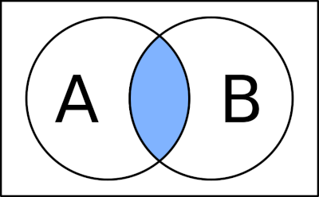
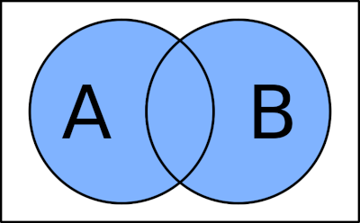
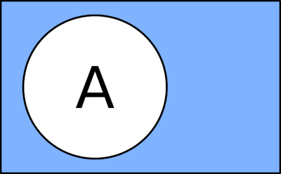
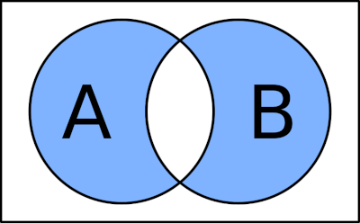
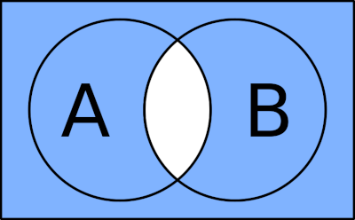
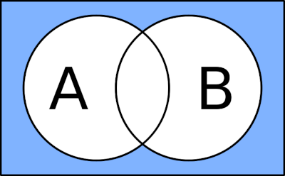

__Boolean algebra__ → way of formally specifying, or describing a particular situation of procedure. Traditionally we use variables to represent the element of our situation, and those **variables** may only take one of two values: **true** or  **false**.

Boolean algebra is useful to describe a process and then build mechanisms which can perform those processes.

## Basic Operations
Operations allow us to define relationships between those variables. There are three basic operations. It is convention to write them in UPPERCASE so they are easily identifiable.

### `AND` (∩)
```
a AND b
```


#### Truth table
A | B | Result
--- | --- | ---
False | False | False
True | False | False
False | True | False
True | True | True

### `OR` (∪)
```
a OR b
```


#### Truth table
A | B | Result
--- | --- | ---
False | False | False
True | False | True
False | True | True
True | True | True

### `NOT` (¬)
```
NOT a
```


#### Truth table
A | Result
--- | ---
True | False
False | True

## Derived Operations
These are shortcuts for commonly used combinations of the basic operations.

### `XOR` or Exclusive OR
```
(a OR b) AND NOT(a AND b)
```


#### Truth table
A | B | Result
--- | --- | ---
False | False | False
True | False | True
False | True | True
True | True | False

### `NAND` or `NOT AND`
```
NOT(a AND b)
```


#### Truth table
A | B | Result
--- | --- | ---
False | False | True
True | False | True
False | True | True
True | True | False

### `NOR` or `NOT OR`
```
NOT(a OR b)
```


#### Truth table
A | B | Result
--- | --- | ---
False | False | True
True | False | False
False | True | False
True | True | False

# De Morgan's Law
De Morgan's Law states that either logical function AND or OR may be replaced by the other, given certain changes to the equation. In simpler terms, every time we "break" the negation line, we replace the AND by OR (or vice versa).

```
NOT(a AND b) => (NOT a) OR (NOT b)
NOT(a OR b) => (NOT a) AND (NOT b)
```

> “Slipt the line, change the sign.”

# Keywords
__Truth table__ → lists all the possible combinations of inputs for an expression and what the result, or output, should be.

# Sources
[Boolean Algebra - 1. Operators and Basics – Ryans Tutorials](https://ryanstutorials.net/boolean-algebra-tutorial/boolean-algebra.php)\
[What is an intuitive way to explain and understand De Morgan's Law? – StackExchange](https://cs.stackexchange.com/questions/350/what-is-an-intuitive-way-to-explain-and-understand-de-morgans-law)\
[Pratical Electronics/Logic/Boolean Identities – WikiBooks](https://en.wikibooks.org/wiki/Practical_Electronics/Logic/Boolean_Identities)