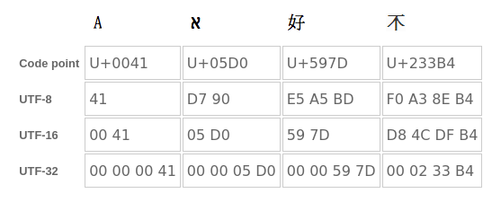
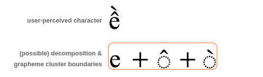

__Character__ → represent letters of the alphabet, punctuation, or other symbols.

__Character set (or repertoire)__ → collection of letters and symbols used in a writing system. Each character is stored as one of more bytes in a computer. Each byte or sequence of bytes represent a given character. Some of the most popular are:
- __ASCII__ → letters and symbols for English text.
- __ISO-8859-6__ → letters and symbols for many languages based on the Arabic script.
- __Unicode__ → characters for most of the living languages and scripts in the world.

__Character encoding__ → key that maps a particular byte or sequence of bytes to particular characters that the font renders as text. If the wrong encoding is applied to the bytes in memory, the result will be unintelligible text. For example, ASCII says A is 65 (01000001), B is 66 (01000010) so on.

__Coded character set (or code pages)__ → set of characters for which a unique number has been assigned to each character.

__Code point__ → represents the position of a character in the coded character set. A Unicode code point can have a value between 0x0000 and 0x10FFFF.

__Character escapes__ → way of representing a character using only ASCII text. They provide a way of representing characters that are not available in the character encoding you are using, or of avoiding the use of the character for other reasons (e.g. when they may conflict with syntax). It's best practice to avoid using character escapes, except for invisible or ambiguous characters.

__Glyph__ → visual representation of a code point. More than one glyph may be used to represent a single code point, and multiple code points may be represented by a single glyph.

## How do fonts fit into this?
__Font__ → collection of definitions of the shapes used to display characters, *ie.* glyph definitions. A given font will usually cover a subset of or a single character set.

Once your browser or app has worked out what characters it's dealing with, it will then look in the font for glyphs it can use to display or print those characters.  If the font doesn't have a glyph for a particular character, some browsers or software applications will look for the missing glyphs in other fonts on your system. Otherwise we will typically see a square box, question mark or some other character instead.

## Declaring and Applying an Encoding
We need to label and save our data in the encoding of our choosing. **Typically it should be UTF-8**, unless there is a very special reason not to.
We also need to ensure the server delivers content with the correct character encoding declarations, since **server settings can override in-document declarations**. The character encoding of the document being sent by the server via HTTP is declared on a HTTP header.
```
Content-Type: text/html; charset=UTF-8
```

_In-document declaration of encoding in HTML:_
```html
<meta charset="utf-8">
```

_In-document declaration of encoding in CSS:_
```css
@charset "utf-8";
```
In CSS, you only need to declare the encoding if your style sheet contains non-ASCII characters and, for some reason, you can't rely on the HTML and style sheet files' encoding to be the same.

## Unicode
Standard that defines in one place all the characters needed for writing the majority of living languages in use on computers. **It aims to be a superset of all other character sets that have been encoded.** It is now fundamental to the Web's and operating systems' architecture, and is supported by all major web browsers and applications.
Unicode is divided in planes:
- __Basic Multilingual Plane (BMP)__ → the first 65,536 code point positions in Unicode's character set. Includes most of the more commonly used characters.
- __Supplementary Characters__ → contains all the other characters in an additional million code point positions. Some of its planes are *Supplementary Multilingual Plane (SMP)*, *Supplementary Ideographic Plane (SIP)*, and *Supplementary Special Use Plane*.

### One character set, multiple encodings
Although the code point for a certain letter in the Unicode coded character set is always the same (*e.g.* á code point will be always 225 in decimal), different encoding forms can be used. This means, the same character can be represented by different bytes. Unicode's encoding forms are:
- __UTF-8__ → 1 byte for characters in the ASCII set ; 2 bytes for characters in several more alphabetic blocks ; 3 bytes for the rest of the BMP ; 4 bytes for supplementary characters.
- __UTF-16__ → 2 bytes for any character in the BMP ; 4 bytes for supplementary characters.
- __UTF-32__ → 4 bytes for all characters.



## Characters & Clusters
The term character is often used to mean different things in different contexts: it can variously refer to the visual, logical, or byte-level representation of a given piece of text. When talking about algorithms, protocols, or document formats, the recommendation is to use it as a synonym for code point.

However, in certain complex scripts, **
  what a user perceives as a smallest component of their alphabet
** (a user-perceived character) **
  may actually be a sequence of code points
**.



It is often important to take into account these user-perceived characters. For example, it is common to treat certain combinations of code points as a single unit for various editing operations, such as line-breaking, cursor movement, selection, deletion, etc. 

__Grapheme clusters__ → sequences of adjacent code points that can be treated as a unit by applications (*e.g.* ề character in Vietnamese). Unicode uses a set of generalized rules to define them. However, these rules have some limitations, so you may need to apply some script-specific tailoring to these rules.

__Typographic character unit__ → indivisible text unit in a given context. The context depends on the operation being applied, *e.g.* in the user-perceived character ề, when deleting forwards should be a single typographic character unit, but three when backspacing. This determination is deferred to the application, rather than spelled out in rules.

# Sources
[W3C](https://www.w3.org/)