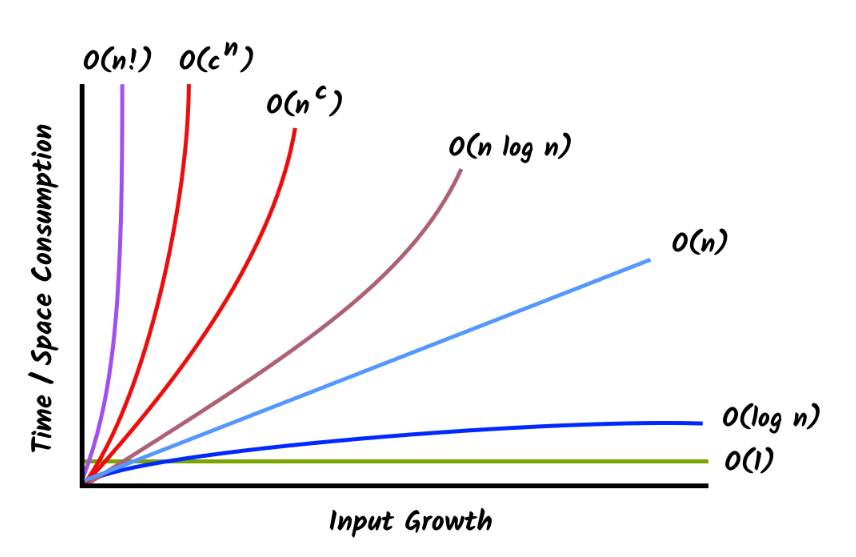
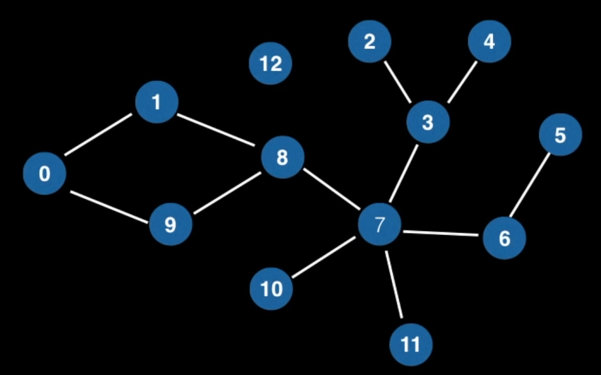
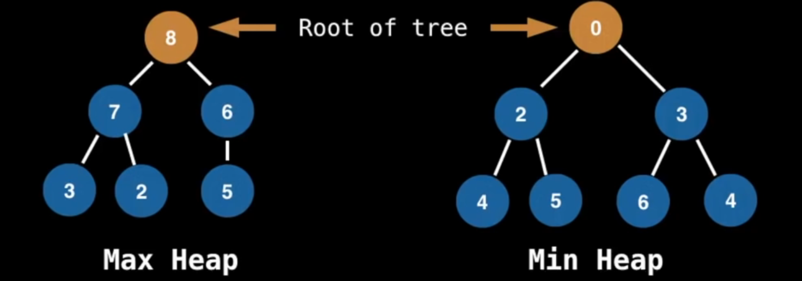
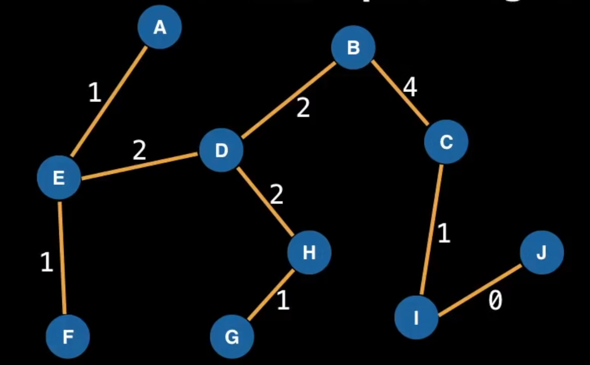
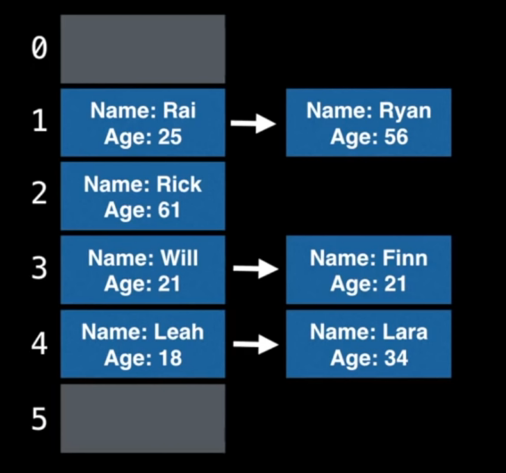
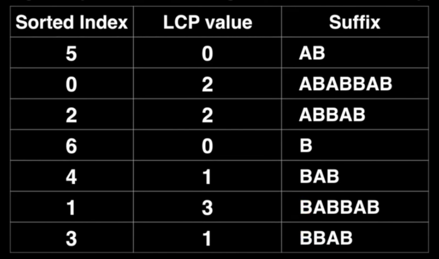
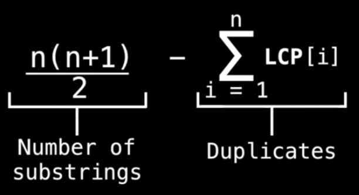
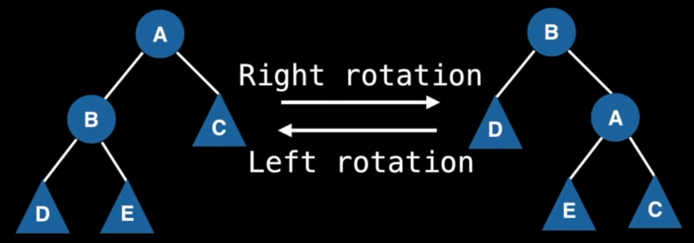

__Data Structure (DS)__ → a way of organizing data so that it can be used effectively. They are essential ingredients in creating fast and powerful algorithms, help to manage and organize data and make the code cleaner.

__Abstract Data Type (ADT)__ → is an abstraction of a data structure which provides only the interface to which a data structure must adhere to. It does not give any specific details about how something should be implemented or in what programming language.

Abstraction (ADT) | Implementation (DS)
--- | ---
List | Dynamic Array
| | Linked List
Queue | Linked List based Queue
| | Array based Queue
| | Stack based Queue
Map | Tree Map
| | Hash Map / Hash Table

# Big-O Notation (Computational Complexity Analysis)
Big-O Notation gives an upper bound of the complexity in the worst case, helping to quantify performance as the input size becomes arbitrarily large. You can care about the time and the space the algorithm takes.

*e.g.* Find the number 7 in a list
- __Worst case scenario__: number 7 is the last element of the list
- __Time complexity__: linear, with respected to the number of elements and size of list

### Possible Complexities
<small>`n` – the size of the input ; Complexities ordered in from the smallest to largest</small>
1. Constant Time: **O(1)**
2. Logarithmic Time: **O(log(n))**
3. Linear Time: **O(n)**
4. Linearithmic Time: **O(nlog(n))**
5. Quadric Time: **O(n²)**
6. Cubic Time: **O(n³)**
7. Exponential Time: **O(bn), b > 1**
8. Factorial Time: **0(n!)**



## How do we find the Big-O?
<center>O(n + c) = O(n)<br>
O(cn) = O(n), c > 0</center>
We only care about the biggest n value.

*e.g.*\
f(n) = 7log(n)³ + 15n² + 2n³ + 8\
O(f(n)) = O(n³)\
n³ is the biggest most dominant term in the function

### Examples
#### Constant Time: O(1)
```
i = 0
While i < 11 Do
  i = i + i
```
It doesn't depent at all on the size of `n`.

#### Linear Time: O(n)
```
i = 0
While i < n Do
  i = i + 3
```
<center>f(n) = n / 3,  O(f(n)) = O(n)</center>

#### Quadratic Time: O(n²)
```
For (i = 0 ; i < n; i = i + 1)
  For (j = 0; j < n; j = j + 1)
```
<center>f(n) = n*n = n², O(f(n)) = O(n²)</center>

#### Logarithmic Time: O(log(n))
```
low = 0
high = n-1
While low <= high Do
  mid = (low + high) / 2

  If array[mid] == value: retuan mid
  Else If array[mid] < value: low = mid + 1
  Else If array[mid] > value: high = mid - 1

return -1 // Value not found
```
We have a sorted array and we want to find the index of a particular value in the array, if exists. This is called a binary search.
<center>O(log2(n)) = O(log(n))</center>

#### Exponential Time: O(bn)
```
i = 0
While i < 3 * n Do
  j = 10
  While j <= 50 Do
    j = j + 1
  j = 0
  While j < n*n*n Do
    j = j + 2
  i = i + 1
```
<center>f(n) = 3n * (40 + n³/2) = 3n/40 + 3n4/2, O(f(n)) = O(n4)</center>

#### Real-life examples
Finding all subsets of a set – **O(2n)**\
Finding all permutations of a string – **O(n!)**\
Sorting using mergesort – **O(nlog(n))**\
Interating over all the cells in a matrix of size n by m – **O(nm)**

## Different Asymptotic Notations
__Big-Ω__ → describes the growth rate in the best scenario.\
__Big-ϴ__ → refers to the tight bound - runtime is bound to be the given complexity and there are no upper or lower bounds.

# Structures
## Static and Dynamic Arrays
__Static Array__ → fixed length container containing n elements indexable from the range [0, n1]. They are continuous chunks of memory. Some uses are:
- temporarily storing objects;
- used by IO routines as buffers;
- lookup tables;
- return multiple values from a function;
- in dynamic programming, to cache answers to subproblems.

__Dynamic Array__ → can grow and shrink in size. Can be implemented with static arrays.

### Implementation of Dynamic Array
1. Static array with an initial capacity.
2. Add elements, keeping track of the number of elements.
3. If adding another element exceeds the capacity, create a new static arraw with twice the capacity of the original and copy the original elements to it.

### Complexity
| | Static Array | Dynamic Array
--- | --- | ---
Access | O(1) | O(1)
Search | O(n) | O(n)
Insertion | | O(n)
Appending | | O(1)
Deletion | | O(n)

## Singly and Doulbly Linked Lists
__Linked list__ → sequential list of nodes that hold data which point to other nodes also containing data. The last node always has a null reference to the next node.
- Used in List, Queue & Stack implementations and circular lists.
- Can model real world objects.
- Used in separate chaining, in Hashtables.
- Used in the implementation of adjacency lists for graphs.

__Singly Linked List__ → only holds a reference to the next node.\
__Doubly Linked List__ → each node holds a reference to the next and previous node.

Singly linked list uses less memory and a has simpler implementation, but you cannot easily access previous elements. In doubly linked lists, you can traverse backwards but they take double the memory.

### Terminology
__Head__ → the first node.\
__Tail__ → the last node.\
__Pointer (or references)__ → reference to another node.\
__Node__ → object containing data and pointer(s).

### Implementation
Most operations start with creating a traversing pointer. When adding or deleting you have to travel with the transverser until the desired node and change the pointers of the previous and new or next node.

### Complexity
| | Singly Linked | Doubly Linked
--- | --- | ---
Search | O(n) | O(n)
Insert at head/tail | O(1) | O(1)
Remove at head | O(1) | O(1)
Remove at tail | O(n) | O(1)
Remove in middle | O(n) | O(n)

## Stack
__Stack__ → one-ended linear data structure which models a real world stack by having two primary operations (push and pop). They are used to:
- undo mechanisms in text editors;
- in compiler syntax checking for matching brackets and braces;
- behind the scenes to support recursion by keeping track of previous function calls;
- can be used to do a Depth First Search (DFS) on a graph.

### Implementation
Stacks are often implemented as arrays, single linked lists or double linked lists.\
Using a linked list, you always add new elements to the head of the list, so when you are popping they are in the correct order.

### Complexity
Using a linked list.
| | |
--- | ---
Pushing | O(1)
Popping | O(1)
Peeking | O(1)
Searching | O(n)
Size | O(1)

## Queue
__Queue__ → linear data structure which models real world queues by having two primary operations, namely enqueue (inserting elements in the back) and dequeue (removing elements in the from). They can me used in:
- waiting lines;
- efficiently keep track of the x most recent added elements;
- web server request management where you want "first come first serve";
- breadth first search (BFS) graph traversal.

#### Breadth First Search (BFS)

In a BFS, you start at one node and traverse the entire graph (graph tarversal). You start with a node and visit it's neighbours, then you visit their neighbours, etc. until you do the entire graph.
To code this, you can use a queue:
```
Let Q be a Queue
Q.enqueue(starting_node)
starting_node.visited = true

While Q is not empty Do
  node = Q.dequeue()
  For neighbour in neighbours(node):
    If neighbour has not been visited:
      neighbour.visited = true
      Q.enqueue(neighbour)
```

### Implementation
The most popular to implement are arrays, single or doubly linked lists.\
Using a linked list, you enqueue the nodes at the end (push the tail forward) and dequeue them at the start (pushing the head forward).\
Implementing with an array is a lot faster than linked lists.

### Complexity
| | |
--- | ---
Enqueue | O(1)
Dequeue | O(1)
Peeking | O(1)
Contains | O(n)
Removal | O(n)
IsEmpty | O(1)

## Priority Queue
__Priority Queue__ → operates similar to a normal queue, except each element has a certain priority. The priority of each element determines the order in which elements are removed from the queue. PQ only supports comparable data, meaning they must be ordered in some way (> or <) so we can assigned them relative priorities. They can be used in:
- implementations of Dijkstra's Shortest Path algorithm;
- when you need to dynamically fetch the 'next best' or 'next worst' element;
- Huffman coding (often used for lossless data compression);
- Best First Search (BFS) algorithms such as A*, continuously grabbing the next most promising node;
- Minimum Spanning Tree (MST) algorithms.

__Heap__ → tree based data structure that satisfies the heap invariant (also called heap property): if A is a parent node of B then A is ordered with respect to B for all nodes A, B in the heap. They can't have loops. There are different times of heaps used to implement a priority queue, including: binary heap (two children for every node), Fibonacci heap, binomial heap, and pairing heap.



__Complete binary tree__ → tree in which at every level, except possibly the last is completely filled and all the nodes are as far left as possible. This gives us an insertion point.

### Implementation
A priority queue is usually implemented with heaps, since this gives them the best possible time complexity.
Binary heaps can use an array to represent a binary heap, although there are other methods.

#### Turning Min PQ into Max PQ
Often the standard library of most programming languages only provide a min heap, but sometimes we need a max heap. Elements implement some sort of comparable interface, which we can simply negate to achieve a max heap.\
*e.g.*\
min PQ → x <= y\
max PQ → x >= y

For numbers, you can negate (put the number negative) them when you insert them and again when they are taken out.

#### Knowing the index of the child nodes
Let `i` be the parent node index\
Left child index: 2i + 1\
Right child index: 2i + 2

#### Adding Elements to Binary Heap
Add elements to the bottom row, as far left as possible to meet the complete binary tree property.\
When you add an element to the heap that violates the heap invariant, you shift the new element with the parent. You keep shifting until the heap invariant is no longer in violation.

#### Removing elements from Binary Heap
To remove an element, you shift the element to remove with the last node. Next, remove the last node (the node we wanted to delete). Check if we are in violation of the heap invariant, and shift the element up or down depending on the necessity. If there is a tie, always choose the left node.\
If the heap has multiple nodes with the same value, you can remove any one of them, it won't make a difference.

_Using an hash table_\
The removal algorithm has to perform a linear search every time it wants to remove. We can use a lookup using a Hashtable to find where a node is indexed at. When there are multiple nodes with the same value we will map one value to multiple positions (Set or TreeSet).\
You have to maintain the table updated. Every time you shift a node, you need to update the index on the hashtable.

### Complexity (w/ Binary Heap)
| | |
--- | ---
Binary Heap construction | O(n)
Polling | O(log(n))
Peeking | O(1)
Adding | O(log(n))
Naive Removing | O(n)
Advanced removing w/ hash table* | O(log(n))
Naive contains | O(n)
Contains check w/ hash table* | O(1)

There is an method to construct a binary heap from an array in linear time. It form the bases for the sorting algorithm Heap Sort.\
\* Using a hash table to help optimize these operations does take up linear space and also adds some overhead to the binary heap implementation.

## Union Find (Disjoint Set)
__Union Find__ → keeps track of elements which are split into one or more disjoint sets. It has two primary operations: find (tell what group that element belongs to) and union (merges two groups together). It's used mostly in:
- Kruskal's minimum spanning tree algorithm;
- Grid percolation (check if there is a path from the bottom of the grid to the top of the grid);
- Network connectivity;
- Least common ancestor in trees;
- Image processing.

### Kruskal's Minimum Spanning Tree
A minimum spanning tree is a subset of the edges wich connect all vertices in the graph with the minimal total edge cost. The steps of the algorithm are:
1. Sort edges by ascending edge weight.
2. Walk through the sorted edges and look at the two nodes the edge belongs to, if the nodes are already unified we don't include this edge, otherwise we include it and unify the nodes.
3. The algorithm terminates when every edge has been processed or all the vertices have been unified.


### Implementation
We start by constructing a bijection (a mapping) between your objects and the integers in the range [0, n[. We can do it arbitrarily, maybe saving them in a hash table for lookups. Store Union Find information in an array. Each index has an associated object we can lookup through our mapping.\
Originally every node will be a root node, so every element maps to itself.

#### Find Operation
You find to which component a particular element belongs by following the parent nodes until a self loop is reached (a node who's parent is itself).

#### Union Operation
To unify two elements, we need to find the root nodes of each component and if the root nodes are different make one of the root nodes be the parent of the other (usually the biggest group will be the parent). We change the values on the array to the index's parent.

#### Observations
We do not "un-union" elements, as it would be very inefficient. The number of components is equal to the number of roots remaining.
The number or root nodes never increases.

#### Path compression
Every time we do a operation, we are going to change the parent's node of the element to the root of the component, if it isn't pointing at it. 

### Complexity
| | |
--- | ---
Construction | O(n)
Union | 𝛼(n)
Find | 𝛼(n)
Get component size | 𝛼(n)
Check if connected | 𝛼(n)
Count components | O(1)

𝛼 → armotized time (almost linear but not quite there)

## Binary Trees & Binary Search Trees (BST)
__Tree__ → undirected graph which satisfies any of the following definitions:
- an acyclic connected graph;
- a connected graph with N nodes and N-1 edges;
- an graph in which any two vertices are connected by exactly one path.

__Binary Tree__ → tree which every node has at most two child nodes.\
__Binary Search Tree__ → binary tree that satisfieds the BST invariant: left subtree has smaller elements than the current node and right subtree has larger elements. You can allow for duplicate values or not.

Sometimes trees can get linear, for that we have  balanced binary search trees.\
Some uses are:
- for Binary Search Trees, implementation of some map and set ADTs, Red Black Trees, AVL Trees, Splay Trees, etc.;
- used in the implementation of binary heaps;
- Syntax trees (used by compiler and calculators);
- Treap – a probabilistic data structrure (uses a randomized BST).

### Terminology
__Root node__ → top node of the tree. It has no parent, but it may be useful to assign the parent to itself.\
__Child__ → node extending from another node.\
__Parent__ → inverse of child node.\
__Leaf node__ → node with no children.\
__Subtree__ → tree entirely contained within another. Usually denoted using triangles.

### Implementation
#### Adding elements
On BST, elements must be comparable. When inserting an element, we want to compare its value to the value stored in the current node deciding to recurse down left subtree (< case), right tree (> case), handle finding a duplicate value (= case) or to create a new node (found a leaf node).

#### Removing elements
When removing an element, we need to find the element we wish to remove and replace the node to remove with its successor.\
Searching for a element we can hit for different values:
1. null node (the value does not exist)
2. comparator value 0 (found the node)
3. comparator value >0 (if exists, is in the left subtree)
4. comparator value <0 (if exists, is in the right subtree).

On the remove phase we can hit four cases:
- node to remove is a leaf node – we do nothing.
- node to remove has a right OR left subtree – we choose the child to be the next node.
- node to remove has both a left and right subtree – we need to choose the biggest value on the left subtree or the smallest value on the right subtree.

#### Tree Traversals
__Preorder__ → prints before the recursive calls.

__Inorder__ → prints between the recursive calls. First process the entire left subtree, then print parent, then process the right subtree. When using a BST, it will print the values in increasing order.

__Postorder__ → prints after the recursive calls. First process the left and right subtree, only then print parent.\
We implement this traversal with a Call Stack.

__Level order__ → print the nodes as they appear one layer at a time. We will perform a Breadth First Search (BFS) from the root node down to the leaf nodes. We will mantain a queue of what's left to explore.

### Complexity
| | Average | Worst
--- | --- | ---
Insert | O(log(n)) | O(n)
Delete | O(log(n)) | O(n)
Remove | O(log(n)) | O(n)
Search | O(log(n)) |O(n)

## Hash Tables
__Hash Table__ → provides a mapping from keys to values (key-value pairs) using a technique called hashing. Keys must be unique and hashable, but values can be repeated.

__Hash Function__ → function that maps a key 'x' to a whole number in a fixed range. Different 'x' values can get the same hash. You can also define hash functions for arbitrary objects (strings, lists, etc.). Keys used in our hash table have to be immutable data types.\
Properties of hash functions:
- If H(x) = H(y), we are not sure if the elements are equal. If H(x) ≠ H(y), we are sure the elements are not the same.
- Must be deterministic - for the same 'x' the function needs to produce the same hash.
- Try to make uniform hash functions to minimize the number of hash collisions.

Use hash functions as a way to index into a hash table (array).

### Terminology
__Hash collision__ → when two objects x, y hash to the same value.\
__Load factor__ → (items in table) / (size of table)

### Hash Collision Techniques
#### Separate Chaining
Maintains a data structure (usually linked list) to hold all the different values which hashed to a particular value. You tell apart each object because you store both the key and value.

To maintain O(1) insertion and lookup time once the table gets really full, you need to resize the table to a larger capacity and rehash all the items inside the old one.

#### Open Addressing
Finds another place within the hash table for the object to go by offsetting it from the position to which it hashed to using a probe sequence. We need to keep tabs on the load factor – once it gets to a certain threshold it gets exponentially bad – resizing it as needed.
```
x := 1
keyHash := H(k)
index := keyHash

while table[index] != null
    index = (keyHash + P(k,x)) mod N
    x = x + 1

insert (k,v) at table[index]
```

### Probing Sequences_
Most randomly selected probing sequences mod N will produce a cycle shorter than the table size, meaning you will ge stuck in a infinet loop. Usually we try to avoid the problem choosing specific probing functions which produce a cycle of exactly length N.
	
<small>N = length of table</small>
#### Linear probing (P(x) = ax + b)
`a` and `N` ned to be relatively prime – their Greatest Common Denominator is equal to one. A common choice is P(x) = 1x.

#### Quadratic probing (P(x) = ax² + bx + c)
The most popular approaches to avoid cycles are:
- P(x) = x², N  = prime number > 3 and 𝛼=½
- P(x) = (x² + x) / 2, N = Z²
- P(x) = (-1x)*x², N = prime N where N ≡3 mod 4

#### Double hashing (P(k, x) = x\*H2(k))
Probes according to a constant multiple of another hash function. H<sub>2</sub>(k) must hash the same type of keys as H<sub>1</sub>(k). Frenquently the hash functions selected to compose H<sub>2</sub>(k) are picked from a pool of hash functions called universal hash functions which generally operate on one fundamental data type.\
`N` = prime number, we can double the size of the table and find the next prime number\
`δ = H2(k) mod N`, if `δ = 0` we get stuck in a cycle, so set `δ = 1`\
At the end we have something like: `H`<sub>`1`</sub>`(k) + 0*δ mod 7 = x`, where 0 increments everytime we need to probe.

#### Pseudo random number generator (P(k, x) = x\*RNG(H(k),x))

### Implementation
We use arrays to build hash tables.

#### Insertion
Compute the hash and add the key-value pair at the index given by the hash function.

#### Lookup
Compute the hash for the given key and check at the index given by the hash function. Go through the linked list (separate chaining) or probe (open addressing) until you get to the value, if exists.

### Removing
Lookup where the object is at, and remove it.\
In case of open addressing, you cannot remove it naively, because of probing. Set the slot to a tombstone (an object). Optimize (relocate the objects) when you pass through one. When resizing the table, don't copy the tombstones.

### Complexity
| | Average | Worst
--- | --- | ---
Insertion | O(1)* | O(n)
Removal | O(1)* | O(n)
Search | O(1)* | O(n)

*The constant time behaviour is only true if you have a good uniform hash function.

## Fenwick Tree
__Fenwick Tree (Binary Indexed Tree)__ → supports sum range queries as well setting values in a static array and getting the value of the prefix sum up some index efficiently. It was created because when you compute all the prefix sums in an array if you changed a value, you would have to recompute all the prefix sums again.

### Implementation
#### Range Queries
Unlike a regular array, in a Fenwick tree a specific cell is responsible for other cells as well. We determine the range of responsability one is responsable for by the position of the least significant bit (LSB).

*e.g.*\
index 11 → 1011 ; 21-1 = 1 → itself\
index 12 → 1100 ; 23-1 = 4 → responsable for 4 the cells preceding it\
index 16 → 10000 ; 25-1 = 16 → responsable for the 16 cells preceding it

All the odd numbers have their least significant bit in position 1, so they are only responsible for themselves.\
To perform a range query, you find the prefix sum of [1, i], then you start at i and cascade downwards until you reach zero, adding the value at each the indices you encounter. To do a interval sum, you calculate the prefix sum of each numbers, and subtract.
```
function prefixSum(i):
  sum := 0
  while i != 0:
    sum = sum + tree[i]
    i = i - LSB(i)
  return sum

function rangeQuery(i, j):
  return prefixSum(j) - prefixSum(i - 1)
```

#### Point Updates
Instead of cascading down as in a range query, we add the LSB to propagate the value up to the cells responsible for us.

*e.g.*
9 = 1001, 1001 + 0001 = 1010
10 = 1010, 1010 + 0010 = 1100
12 = 1100, 1100 + 0100 = 10000
16 = 10000

So you only need to modify the cells responsible for it.
```
function add(i, x):
    while i < N:
        tree[i] = tree[i] + x
        i = i + LSB(i)
```

#### Construction
Add the value in the current cell to the immediate cell that is responsible for us (similar to point updates). This will propagate the value in each cell throughout the tree.
```
# Make sure the 'values' array is one-based
function construct(values):
  N := length(values)

  # Clone the values
  tree = deepCopy(value)
  
  for i = 1,2,3, ... N:
    j := i + LSB(i)
    if i < N:
      tree[j] = tree[j] + tree[i]

  return tree
```

### Complexity
| | |
--- | ---
Construction | O(n)
Point Update | O(log(n))
Range Sum | O(log(n))
Range Update | O(log(n))
Adding Index | N/A
Removing Index | N/A

## Suffix Array
__Suffix__ → substring at the end of a string of characters.\
*e.g.* HORSE → E, SE, RSE, ORSE, HORSE

__Suffix Array__ → array which contains the sorted indexes of a string's suffixes. Provides a compressed representation of the sorted suffixes without actually needing to store them. It's a space efficient alternative to a suffix tree, which itself is a compressed version of a trie.

__Longest Common Prefix (LCP) Array__ → tracks how many characters two sorted adjacent suffixes have in common. Helps the Suffix Array to perform all actions a suffix tree can do.


### Problems
#### Finding Unique Substrings
A LCP array can be used to find/count all the unique substrings of a string. The naive algorithm generates all substrings and places them in a set (O(n²)). This array is quicker but also a space efficient solution.

The LCP value means that are x values in common between a suffix, by other words, repeated ones.
To calculate the number of uniqlue substrings in a string:


#### Longest Common Substring (K-Common Substring problem)
*Problem*: we want to find the longest common substring that appear in 2 ≤ k ≤ n. k = minimum of  strings sharing the same substring

*Naïve solution*: using dynamic programing running in O(n<sub>1</sub> * n<sub>2</sub> * n<sub>3</sub> * ... * <sub>nm</sub>), n<sub>i</sub> = length of string S<sub>i</sub>. Ok for a few small strings.

*LCP Array solution*: use a suffix array, which can find the solution in O(n<sub>1</sub> + n<sub>2</sub> + n<sub>3</sub> + ... + n<sub>m</sub>) time.
1. Concatenate all the string into a larger one, separated by unique sentinels (&, #, %, etc.) lexicographically less than any of the characters contained in any of the strings S<sub>i</sub>, so we don't mix any of the suffixes.
2. Construct the Suffix Array with LCP. Look for different strings which share the largest LCP.
	
Sometimes the different strings will not be exactly adjacent. So we use a sliding window to capture the correct amount of suffixes. At each step, advance the bottom or the top endpoint such that the window contains exactly K suffixes of different strings. You can use a hash table to track the different strings in our sliding window. The LCS will be the maximum LCP value for all possible windows.\
The mininum sliding range query problem can be solved in a total of O(n) time for all windows.

#### Longest Repeated Substring (LRS)
*Problem*: we want the find the longest repeated substring in a string.

*Naïve solution*: requires O(n²) time and lots of space.

*LCP Array solution*: You create a LCP array and look for the largest value. It's possible to have more than one solution.

## Balance Binary Tree
__Balanced Binary Search Tree (BBST)__ → self-balancing binary search tree. It will adjust itself in order to maintain a low (logarithmic) height allowing for faster operations. The secret ingredient is the clever usage of a tree invariant and tree rotations.

__Tree Invariant__ → property/rule you impose on your tree that it must meet after every operation.

### Tree Rotations
Changes the structure of a tree to balance it. It also ensures the tree invariant is respected. It works because in the left tree we know that D < B < E < A < C and this remains true for the right subtree. It does not matter what the structure of the tree looks; all we care about is that the BST invariant holds. So we can shuffle/transform/rotate the values and nodes as we please.


```
function rightRotate(A):
  B := A.left
  A.left = B.right
  B.right = A
  # With a AVL Tree, after rotation we need to update balance factor and height values
  # update (A)
  # update (B)
  return B
```
If node A has a parent, we also need to update that link. Usually done on the recursive callback using the return value of rotateRight.

In some BBST implementations where you often need to access the parent/uncle nodes, it's convenient for nodes to also have a reference to the their parent node. This can complicate tree rotations, since you have to update 6 pointers.
```
function rightRotate(A):
  P := A.parent
  B := A.left
  A.left = B.right
  if B.right != null:
    B.right.parent = A
  B.right = A
  A.parent = B
  B.parent = P
  #Update parent down link
  if P != null:
    if P.left == A:
      P.left = B
    else:
      P.right = B
  return B
```

### Implementation (AVL Tree)
There are multiple possibilities to implement a BBST. Some of them are AVL tree, 2-3 tree, AA tree, scapagoat tree, and red-black tree. AVL Tree was the first type of BBST to be discovered, and the one this implementation talks about.

__Balanced Factor (BF)__ → property which keeps an AVL tree balanced. The balance factor always has to be either -1 (left), 0 or +1 (right). The balance factor is calculated by (H = height):
```
BF(node) = H(node.right) - H(node.left)
```
So, everytime a node's balance factor is off, we need to adjust the tree using tree rotations.
-	Left Left Case → Right Rotation
-	Left Right Case → Left Rotation (left node) → Right Rotation
-	Right Right Case → Left Rotation
-	Right Left Case → Right Rotation (right node) → Left Rotation

#### Insertion
The insertion of a node in a AVL tree is similar to an insertion on the BST tree. We only need to add the update method to update the balance factor and the node's height and the balance method to balance the tree.
```
function insert(node, value):
  ... BST insertion code ...

  # Update balance factor and height values
  update(node)

  # Rebalance tree
  return balance(node)
```

#### Updating balance factor and height values
```
function updade(node):
  # Variables for left/right subtree heights
  lh := -1
  rh := -1
  if node.left != null: lh = node.left.height
  if node.right != null: rh = node.right.height

  # Update this node's height
  node.height = 1 + max(lh, rh)

  # Update balance factor
  node.bf = rh - lh
```

#### Balancing the tree
```
function balance(node):
  # Left heavy subtree
  if node.bf == -2:
    if node.left.bf <= 0:
      return leftLeftCase(node)
    else:
      return leftRightCase(node)

  # Right heavy subtree
  else if node.bf == +2:
    if node.right.bf >= 0:
      return rightRightCase(node)
    else:
      return rightLeftCase(node)

  # Node has a balance factor of -1, 0 or +1 which we do not need to balance
  return node
```

#### Removal
It's similar to the removal of a Binary Search Tree. We only need to add the function to update the balance factor and heights and to balance the tree.
```
function remove(node, value):
  ... # Code for BST item removal ...
  update(node)
  return balance(node)
```

### Complexity
| | Average | Worst
--- | --- | ---
Insert | O(log(n)) | O(log(n))
Delete | O(log(n)) | O(log(n))
Remove | O(log(n)) | O(log(n))
Search | O(log(n)) | O(log(n))

## Indexed Priority Queue
__Index Priority Queue__ → traditional priority queue variant which also supports quick updates and deletions of key-value pairs. We need to store different mapping:
- bidirectional mapping between your N keys and the domain [0, N[, using a bidirectional hashtable
- values of priority for each key
- the index of the node in the heap (position map)
- inverse lookup of the index in the heap to the key

### Implementation 
We use a bidirectional hashtable to map the N keys to the values. For the rest we can use an array. The operations work the same as the traditional Priority Queue, we just need to maintain all the mappings updated.

#### Decrease and Increase key
Sometimes is useful to only update a given key to make its value either always smaller or larger (e.g. Dijkstra's and Prims algorithm). In the event that a worse value is given the value in the IPQ should not be updated. It's a more restrictive form of update operation. We simply perform an if statement to verify if the value we are changing it to satisfies what we want.

### Complexity (Indexed Binary Heap Priority Queue)
| | |
--- | ---
delete(ki) | O(log(n))
valueOf(ki) | O(1)
contains(ki) | O(1)
peekMinKeyIndex() | O(1)
pollMinKeyIndex() | O(log(n))
peekMinValue() | O(1)
pollMinValue() | O(log(n))
insert(ki, value) | O(log(n))
update(ki, value) | O(log(n))
decreaseKey(ki, value) | O(log(n))
increaseKey(ki, value) | O(log(n))

# Sources
[Data Structures easy to Advanced - Full Tutorial from a Google Engineer – Youtube](https://www.youtube.com/watch?v=RBSGKlAvoiM)