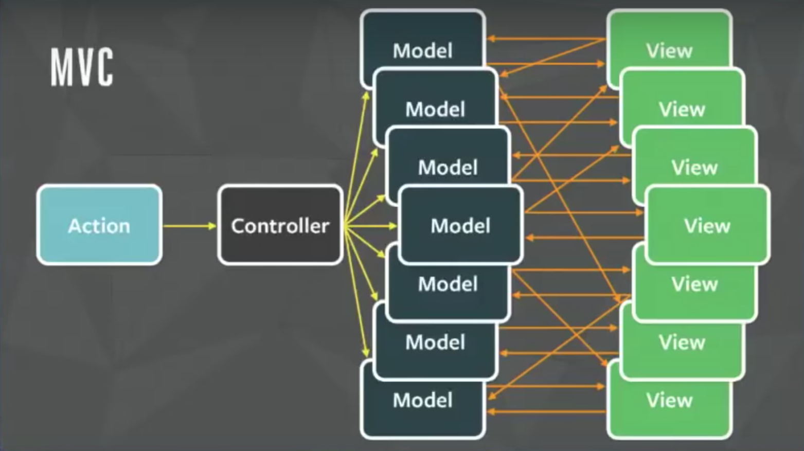

__Redux__ → state management framework. Can be used with different web tecnologies, including React. Redux removes the state out of each component to a store. The state is passed down to the components via props.

This doesn't mean Redux completely replaces React's state - it's still possible to have a local state for each component. They can be used together.

Redux can theoretically be used with any framework. Therefore, we also need the *react-redux* package so the containers (smart components) are able to communicate with the Redux store. Presentational components will only know about the existence of Redux.
```
$ npm install redux react-redux
```

### Why use Redux?
1. Good for managing large state, *e.g.* on very large applications.
2. Useful for sharing data between containers. With React this is done moving the state up to a parent container, but Redux makes things easier.
3. Predictable state management using the 3 principles.
    - Single source of truth.
    - State is read only.
    - Changes using pure functions.

## Flux Pattern vs. MVC Pattern
The **Flux Pattern** inspired the library Redux. The dispatcher dispatches an action to the store, changing the state, which updates the view. Everything flows one way.
[](https://facebook.github.io/flux/docs/in-depth-overview "Flux In-Depth Overview - Facebook GitHub.io")

The **Model-View-Controler (MVC)** is a  popular framework predating the Flux Pattern. The controller receives an action, which then updates the model (data) according to what the controler says. After the model is updated, the view changes.
[](https://www.youtube.com/watch?v=nYkdrAPrdcw "Hacker Way: Rethinking Web App Development at Facebook")
The problem starts with the controler having to change different models.

# Redux & React-Redux
## Action & Reducer
In it's simples form, an action is an object that is dispatched, which represents an action the user did.

```javascript
import { CHANGE_SEARCH_FIELD } from './constants'

export const setSearchField = (text) => ({
  type: CHANGE_SEARCH_FIELD,
  payload: text
})
```
- `type` → is the type of action we're dispatching. It is best practice to use string constants as the type. Creates a safeguard against mistyping, plus all actions will be in one file. This makes it easier to immediately know all the existing action types.
- `payload` → the state to be updated.

The reducer is a function that takes an action and updates the state.

```javascript
import { CHANGE_SEACH_FIELD } from './constant'

const initialStateSearch = {
  searchField: ''
}

export const searchRobots = (state = initialStateSearch, action = {}) => {
  switch(action.type) {
    case CHANGE_SEARCH_FIELD:
      return Object.assign({}, state, searchField: action.payload)
    default:
      return state
  }
}
```
In Redux, one of the main principles is the immutability of the state. We must return a new state every time a new action is dispatched. If none of the action type matches, the current state must be returned.

## Redux Store & Provider
The store is the source of all truth - the object describing the entire state of the app.
```javascript
// ...
import { createStore } from 'redux'
import { searchRobots } from './reducers'
// ...

const store = createStore(searchRobots)
```

With the store created, we need to pass down the store our components. For this, we use the `Provider` component from the React Redux package, and wrap the root component in it.
```javascript
// ...
import { Provider } from 'react-redux'
// ...

ReactDOM.render(
  <Provider store={store}>
    <App />
  </Provider>,
  document.getElementById('root')
)
```

### Combining Reducers
It's good practice make each reducer specific to their use case. For that, we need to combine all the reducers into one root reducer. We can use Redux's `combineReducers` function.

```javascript
// ...
import { createStore, combineReducers } from 'redux'
import { searchRobots, otherReducer } from './reducers'
// ...

const rootReducer = combineReducers({ searchRobots, otherReducer })
const store = createStore(rootReducer)
```

## Connecting Our Containers to The Redux Store
The `connect` function of the React Redux package simplifies the proccess of having to subscribe a component to every change we want it to be aware of (`store.subscribe()`).

```javascript
import { connect } from 'react-redux'
// ...
import { setSearchField } from '../actions'

const App = () => {
  // ...
}

export default connect(mapStateToProps, mapDispatchToProps)(App)
```

We need to tell the `connect` function what state and action we are interested in. For this, we use `mapStateToProps` (the state) and `mapDispatchToProps` (the actions).

```javascript
const mapStateToProps = (state) => {{
  searchField: state.searchRobots.searchField
}}

const mapDispatchToProps = (dispatch) => {{
  onSearchChange: (event) => dispatch(setSearchField(event.target.value))
}}
```

Afterwards, we can access the state and the action dispatch via the `props`.

## Middleware
Middleware can be used to change the action's default behavior in Redux, *e.g.* modify the action, trigger another action, etc. The actions go through it, something happens, and only then they get to the reducer.

A good example is the *redux-logger* package. Every time an action is dispatched, it logs it to the console. It's useful for the development stage of our app.
```javascript
// ...
import { createStore, applyMiddleware } from 'redux'
// ...

const logger = createLogger()
const store = createSTore(rootReducer, applyMiddleware(logger))
```
The action goes through each middleware in order, from left-to-right.

### redux-thunk
Middleware that helps us handle asynchronous actions like AJAX calls. It provides a `getState` and `dispatch` functions that are passed on, and make us able to handle side-effects. Redux-thunk intercepts actions that return a function instead of an object.

```
npm install redux-thunk
```
There are other packages to help us handle asynchronous calls. *redux-thunk* is the simplest to start off with.

_Applying the middleware to Redux:_
```javascript
import thunkMiddleware from 'redux-thunk'
// ...

const store = createStore(rootReducer, applyMiddleware(thunkMiddleware))
```

The standard is to have 3 different actions for asynchronous calls: **pending**, **success**, and **failed**.
```javascript
export const requestRobots = () => (dispatch) => {
  dispatch({ type: REQUEST_ROBOTS_PENDING })
  fetch('https://apilink.com/robots')
    .then(res => res.json())
    .then(data => dispatch({
      type: REQUEST_ROBOTS_SUCCESS,
      payload: data,
    }))
    .catch(error => dispatch({
      type: REQUEST_ROBOTS_FAILED,
      error: error.message,
    }))
}
```

We then can create a new reducer to handle the asynchronous request.
```javascript
const initalStateRobots = {
  isPending: false,
  robots: [],
  error: '',
}

export const requestRobots = (state = initalStateRobots, action = {}) => {
  switch(action.type) {
    case REQUEST_ROBOTS_PENDING:
      return Object.assign({}, state, { isPending: true })
    case REQUEST_ROBOTS_SUCCESS:
      return Object.assign({}, state, { robots: action.payload, isPending: false })
    case REQUEST_ROBOTS_FAILED:
      return Object.assign({}, state, { error: action.payload, isPending: false })
    default:
      return state
  }
}
```

Next, we need to update the `mapStateToProps` and `mapDispatchToProps` with our new state and action.
```javascript
const mapStateToProps = (state) => {{
  // ...
  robots: state.requestRobots.robots,
  isPending: state.requestRobots.isPending,
  error: state.requestRobots.error,
}}

const mapDispatchtoProps = (dispatch) => {{
  // ...
  onRequestRobots: () => dispatch(requestRobots())
}}
```

# Redux Project Structure
As our application grows in size, our constants, actions, and reducers files also start growing in length and complexity. And eventually, we will also have multiple container components.

*react-redux* makes easy to have multiple containers - simply add the `connect` function to it. It is also good practice to put the container components and their children presentational components in their own folder, with one constants, one actions, and one reducers file for each one of the container components.

We can also move code we use a lot, *e.g.* fetch calls, to their own function, so we don't have to keep repeating the same code.

# Keywords
__State__ → describes how our app should look like.

__Action__ → something the user does, *e.g.* clicking on a button.

__Reducer__ → pure function that receives the an input (the action), and creates an output (the state).

__Store__ → object containing the entire state of the app.

__Presentational Component__ → React components that are not directly connected to Redux. They are simply responsible for the presentation of the UI.

__Container__ → React component responsible for dispatching actions to the store. They use the `connect()` function from *react-redux* package to connect to the store.

# Sources
[freeCodeCamp](https://freecodecamp.org)\
[The Complete Junior to Senior Web Developer Roadmap (2020)](https://www.udemy.com/course/the-complete-junior-to-senior-web-developer-roadmap/), by Andrei Neagoie
