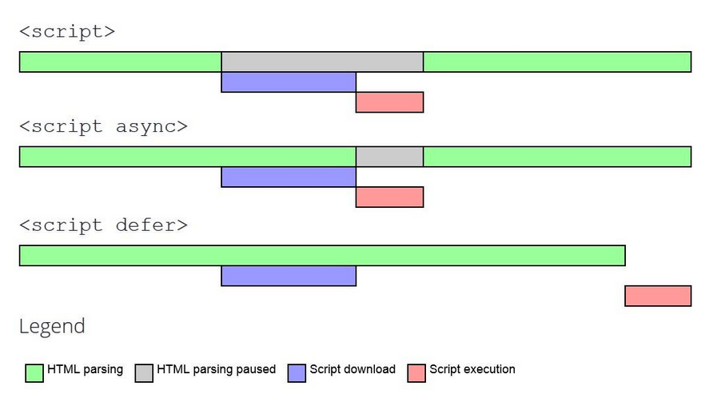

There are three ways to increase the speed of our website:
1. improve what happens on the client side – the time to render the page on the screen.
2. transfer of our files – network latency, the time to travel from our client to the server and back.
3. processing done on the backend – the time to load data and assemble the website before it is sent.

> “An average website makes more than 100 requests to load completely.”

We need to know where what's slowing down the website and have the tools to measure if our changes have solved the problem.

# Transfer
The more kilobytes a user needs to download the longer it takes to load the website. Therefore, we need to reduce the amount of data being transfered:
- minify the HTML, CSS, and JavaScript files;
- optimize images and use smaller images when the website is used on a smaller screen.

## Images
The primary way to change an image size is to change the file format and pick the format that is the best for the job. The four main image file formats are:
- __JPEG__ → images with many colors, *e.g.* photographs. Don't allow transparency, and tend to be big in file size.
- __GIF__ → usually limits the number we can use in a gif (2 - 256). Good for small animations.
- __PNG__ → limit the number of colors we can use. Tend to be smaller than JPEGs. Used a lot for logos.
- __SVG__ → vector graphics. Small in file size. Good for retina display or 4k displays. Tend to be simplistic.

Newer file formats have been created with superior compression, meaning images will be loaded faster and consume less data. *e.g.* JPEG 2000. However, browser support isn't there yet.

#### Compression
We can also use tools to compress images – especially JPEG and PNG. An example is [TinyPNG](https://tinypng.com/) for PNGs, and [JPEG-optimizer](http://www.jpeg-optimizer.com/) for JPG. We can also save JPG files with less quality (30 - 60%).

#### Resize image based on display size
If we're displaying an image at only 500px wide, we don't need to keep the image a heigher width. Resize or chop the image to the actual size it will be displayed. The larger the resolution the larger the file size.

Same can be applied to background images. We can use media queries to change the background image according to the device's size.

#### Use Content Delivery Networks (CDNs)
They take care of optimization and delivery for us, including caching. An example of such service is [imgIX](https://www.imgix.com/). They'll give us an URL we can use in our website.

#### Remove metatags
When a photo is taken, extra data, such as the device used, date, and location is also saved. This data is extra information we don't need, and increases the photo's size. We can use [online tools](https://www.verexif.com/en/) or programs to remove it.

## Reducing Download Frequency
In HTTP1, there is a maximum amount of files the HTTP protocol allows to concurrently download from the same domain (depends on the browser). By reducing the amount of components a page requires, we reduce the number of HTTP requests we have to make. HTTP also has a limit to a file's total size.

We can minimize our files and combine them into one. This no longer applies in HTTP2, since you can request multiple files per connection.

When using big libraries and frameworks, like Bootstrap or Foundation, we need to ask ourselves if they are really needed. Can we use flexbox or CSS grid instead? Do we really need jQuery? If we must use a library, maybe we can find lightweight ones.


# Frontend
## Critical Render Path
1. Request a website, the server returns an HTML file.
2. The browser starts reading the HTML file.
3. While it's parsing the HTML, it incrementally generates the tree model of HTML tags, known as the Document Object Model (DOM). The DOM describes the content of the page.
4. When it encounters a styl e link, the browser asks the CSS file from the server. It continues to work on the DOM.
5. After the CSS file arrives, the browser also starts generating a tree model called CSS Object Model (CSSOM). The tree describes how the content is styled.
6. When it encounters a JavaScript file in a script tag, it grabs it from the server. The browser reads it and executes anything it might change on the DOM.
7. Once all of that is done, it combines both DOM and CSSOM into a render tree. The browser will then use this render tree to figure out the layout.
8. When it's done figuring out, it will paint all the pixels. Finally, we will have our website.

The Critical Render Path shows what it takes to pain the website on the screen. Usually, CSS and JavaScript files take high priority, while other files like images take lower priority.

### DOM
We want to load CSS files as soon as possible, and JavaScript files as late as possible. `script` tags may block HTML and CSS from rendering. There are some exceptions, but generally we want CSS files in the `head`, and JavaScript at the bottom of the page.

### CSSOM
CSS is **render-blocking** - in order to construct the rendered tree we need to wait for the CSSOM to complete. So it makes sense to make it as lightweight as possible.
- __Only load whatever is needed__. Make sure you don't have any unused files and/or styles being loaded.
- __Above the fold loading__. We can move non-critical styles or things we'll only see later in the page to a separate file, and load that file after. We can do this with a bit of JavaScript.
- __Media attributes__. It's possible to use media attributes on the HTML file itself. On the `link` tag, we can add a `media` tag with the query we want. The CSS file will only be loaded if it matches. Useful to load files for specific screen sizes.
- __Less Specificity__. The more information we send, the more bytes that is. However, this isn't as important as the others.

### JavaScript
JavaScript can modify both the DOM and CSSOM. It's **parser-blocking** - only when both the DOM and CSSOM + the modifications by JavaScript are finished, the page can go through the Render Tree, Layout, and finally Paint.
- __Load scripts asynchronously__. When HTML is parsing and encounters a script tag, it will stop reading to download the JavaScript file and execute it. We can use HTML attributes to change this behavior.
[](https://developers.google.com/web/fundamentals/performance/optimizing-content-efficiency/loading-third-party-javascript "Loading Third-Party JavaScript – Web Fundamentals")
  - no tag → critical, app scripts.
  - `async` → scripts that don't affect the DOM or CSSOM, for example, external scripts that require no knowledge of our code. *e.g.* Google Analytics scripts
  - `defer` → third-party scripts that act on the DOM tree, but not important to load *above the fold* content.
- __Minimize DOM manipulation__ → the browser will have to do extra work if we're manipulating the DOM/CSSOM via JavaScript.
- __Avoid long running JavaScript__ → if we have JavaScript code that's executing for a long time, we'll have a poor user experience. *e.g.* `alert()`

#### Redraw
During runtime, JavaScript makes changes on the DOM/CSSOM, causing the browser to go through the Render Tree, Layout, and Paint phases again. Current browsers are smart enough to only do a partial update, however we can't be reliant on it to be efficient or performant. It's our job to make sure it's efficient.

## Animations
Animations require a lot of processing and graphics power, and can cause serious lag. This is essentially true when it comes to mobile devices that usually have weaker procesing power.

The best example are animations during scrolling, *e.g.* fading elements while scrolling. The browser has to process both the visual changes associated with the scrolling a dynamic page, and all our animations at the same time.

## Code Splitting
__Code Splitting__ → allows us to reduce the amount of work being done during the execution, by sending only the necessary JavaScript to the page being visited by the user.

This is achieved using a tool like Webpack, and dynamic imports.
```javascript
import('./components/Page2').then((Page2) => /** do something with the component **/)
```
In React, to access this component if it was exported using the `default` keyword, we have to write `Page2.default`.

When it comes to code chunking, there are two ways to do it:
- __Route-based Chunking__ → splits the JavaScript files based on the routes. Most of the time, this is what you want to do.
- __Component-based Chunking__ → split on a component level. Better for when the homepage gets really really big. We can apply it on small, hidden components, *e.g.* a hidden menu. Because the code is so small, it will load fast.

There are multiple ways to approach code splitting in a project sense. One of them is creating an Higher Order function:
```javascript
export default function asyncComponent(importComponent) {
  function AsyncComponent(props) {
    const [Component, setComponent] = useState(null);

    useEffect(() => {
      const { default } = await importComponent();
      setComponent(default);
    }, [])

    return Component ?
      <Component {...props} />
      : null
  }

  return AsyncComponent
}

// On the page we want to import the component
//...
} else if(route === 'page2') {
  const AsyncPage2 = AsyncComponent(() => import('./components/Page2'));
  return AsyncPage2
}
//...
```
We can also use libraries like [React Router](https://reactrouter.com/), and [Loadable components](https://loadable-components.com/).

### `React.lazy()`
`React.lazy()` was added in version 16.6. It allows us to do code splitting very easily. However is not yet available for server side rendered apps.
```javascript
const OtherComponent = React.lazy(() => import('./OtherComponent'));
```

It can take a few milliseconds to load this asynchronous component. So the user is not staring at a blank screen while this async component loads, we can use a `Suspense` component. It will display something else while the async component is loading.
```jsx
<Suspense fallback={<div>Loading...</div>}>
  <OtherComponent />
</Suspense>
```

# Keywords
__Vendor file__ → file with JavaScript code that will be used in our entire app, *e.g.* ReactJS library. Usually it's comprimised of third-party scripts.

__Production build__ → build that is faster than the development build - the file is minified, tools such as debugging tools are removed, etc. Created by running the command `npm run build`.

__Tree Shaking__ → removing all unsed code when building our app. Webpack can be setup to do this for us.

# Sources
[The Complete Junior to Senior Web Developer Roadmap (2020)](https://www.udemy.com/course/the-complete-junior-to-senior-web-developer-roadmap/), by Andrei Neagoie
