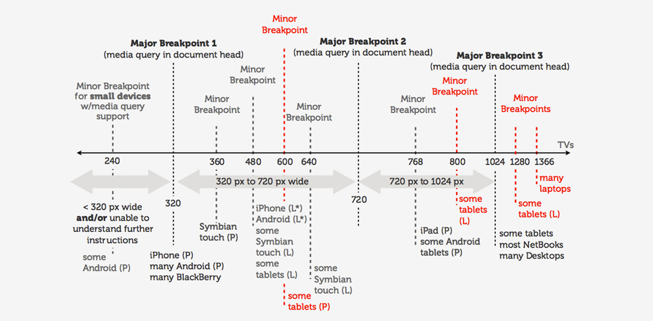

Everything must be flexible.

### Pick Major Breakpoints
Minimum of 3 breakpoints – one for each type of device (mobile,  tablet, and desktop). Use 4 for the most device flexibility.

### Use Fluid Images and Video
Images should be rendered at their native dimension so long as there is enough room in the HTML container to do so. On smaller screens, crop some images so they retain their impact.\
Try Scalar Vector Graphics.

### Pay Attention to Font Sizes
Be sure the typography you choose works well whether you scale it larger or smaller.\
Use sufficient color contrast and an easily readable font.\
Make big headlines (1.6x) and body text responsive (em/rem).

### Design the Smallest Views First
> “The mobile-first approach is also a content-first approach. The heart of the site is content — that’s what the users are there for.” It will help you separate the essential elements from the secondary ones.

### Use Design Patterns
- Mostly Fluid → introduces larger margins on big screens, relies on fluid grid. Used in marketing, eCommerce and news sites.
- Column Drop → fills the available space regardless of size. Used when users will view on a very wide range of displays.
- Off Canvas → pushes secondary content out of sight. Good for sites that need to focus on large amounts of content.
- Layout Shifter → requires designers to consider each breakpoint range as if it were an independent design. Works well for visual-heavy sites.

### Don't Forget About Visual Hierarchies
Prioritize the elements in the content inventory and determine how to display the most important elements prominently.

# Sources
[Responsive Design Best Practices - UX Planet](https://uxplanet.org/responsive-design-best-practices-c6d3f5fd163b)